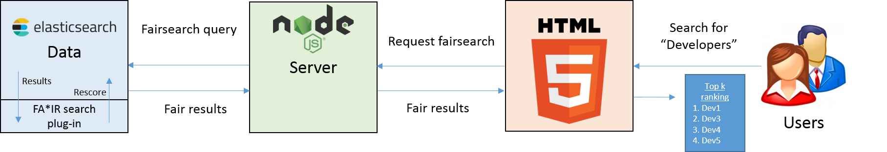

# Example Application
This is a step-by-step tutorial to set up an Elasticsearch Application with the fairsearch plug-in on your local machine.
We highly recommend to read [FA*IR: A Fair Top-k Ranking Algorithm](https://arxiv.org/abs/1706.06368) before you go through this tutorial since we will not explain the theory behind the plugin in this tutorial.

# Goal of this Tutorial
Our goal with this tutorial is to set up a Node.js Web search application which uses Elasticsearch with the fairsearch plug-in.
However there are uncountable ways to use Elasticsearch and many different possible infrastructures, we want to provide an easy tutorial to get a feeling how to work with the fairsearch plug-in and Elasticsearch.
Our target infrastructure will look like this:


### Install Elasticsearch
The first thing we need is Elasticsearch. Download [Elasticsearch 6.2.4](https://www.elastic.co/de/downloads/past-releases/elasticsearch-6-2-4).
Once you have downloaded it, unzip it to a location of your choice. In this Tutorial, we will unzip it to "C:\Users\Demo\".
You have now installed Elasticsearch! You can run it with `C:\Users\Demo\elasticsearch-6.2.4\bin>elasticsearch`.

Elasticsearch will run on the port 9200 per default.

### Install the Plugin
Download the the snapshot build of the plugin [fairsearch-1.0-es6.2.4-snapshot.zip](https://github.com/fair-search/fairsearch-elasticsearch-plugin). This is just one way to get the current build of the plugin. See [README.md](README.md) for other options.
We will assume that we downloaded the plugin snapshot to the directory `C:\Users\Downloads\`. 
Navigate to the bin folder of your Elasticsearch folder:
```
C:\Users\Demo\elasticsearch-6.2.4\
cd bin
C:\Users\Demo\elasticsearch-6.2.4\bin>
```
and then enter the following command:
```
C:\Users\Demo\elasticsearch-6.2.4\bin>
elasticsearch-plugin install file:///C:\Users\Downloads\fairsearch-1.0-es6.2.4-snapshot.zip
```
You have now installed the fairsearch plugin!

### Install Node.js
Download Node.js [from here](https://nodejs.org/en/download/) and install it on your local machine.

### Create the Project Directory
Our Project directory will be located in `C:\Users\Demo\App\`. We will use [npm](https://www.npmjs.com/) to install all important dependencies for our node server.
Run the following command:
```
C:\Users\Demo\App> npm init
```
and follow the instructions. This will create a local npm module folder in our project directory.
